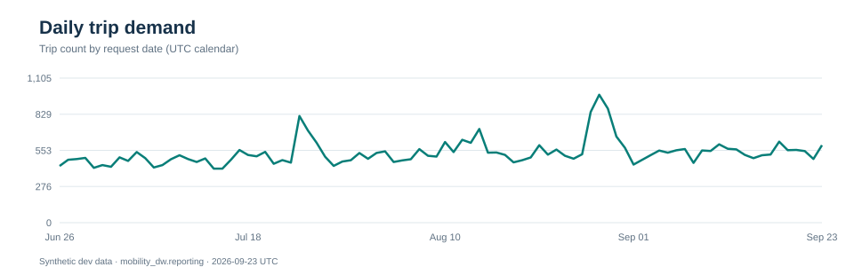
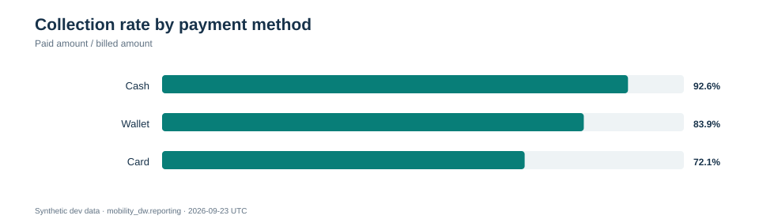
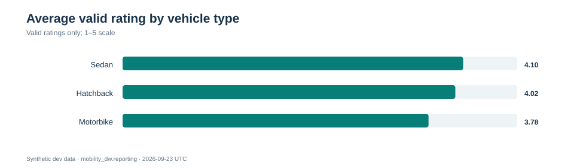
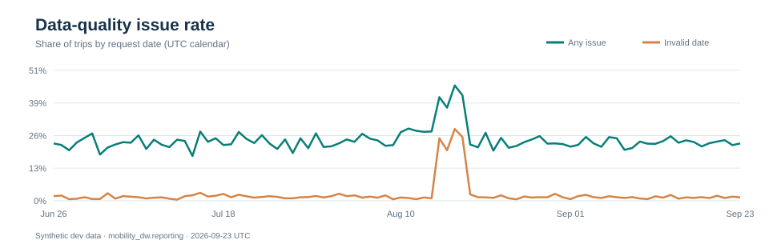

# Urban Mobility Data Pipeline

A local, cloud-shaped data engineering project: a medallion lakehouse
(PostgreSQL OLTP → Bronze → Silver → Gold) with an analytics serving layer
(PostgreSQL `mobility_dw` → Power BI target), built with **PySpark 3.5 +
Delta Lake 3.1**, orchestrated by **Airflow 2.10 (Celery) on Docker
Compose inside WSL 2**, plus GDPR right-to-be-forgotten propagation and
retention/vacuum housekeeping.

The source OLTP intentionally produces incomplete, inconsistent, "dirty"
operational data; the pipeline's job is to make it trustworthy
deterministically (see `docs/data_contracts.md`).

## Why this project exists

A mobility platform needs to answer four questions from events that are often
late, incomplete or inconsistent: **where demand and waiting time rise, whether
trips turn into collected revenue, what affects rider experience, and whether
the evidence behind those answers is reliable**. The data here is synthetic;
the project demonstrates the engineering and decision workflow, not claims
about a real city or company.

The generator deliberately combines plausible business variation (time of
day, zone role, trip distance, payment method and driver quality) with
independent quality defects. A short simulated importer incident increases
bad source-date text. This lets the dashboard tell a useful story and lets the
pipeline prove that a visible pattern survives cleaning and reconciliation.

| Decision area | Question a team could answer | Dashboard evidence |
|---|---|---|
| Operations | Where should dispatch capacity be reviewed, and when do riders wait longer? | Trip volume by date and local hour, zone demand, completion/cancellation, median and P90 acceptance delay. |
| Revenue | Which trips produce fares, which payment methods collect them, and where are completed trips missing a paid payment? | GMV, billed and collected amounts, collection rate by method, zone and driver revenue, revenue leakage proxy. |
| Experience | Do delays and vehicle type coincide with weaker ratings or more cancellations? | Rating distribution, driver delay-versus-rating view, rating by vehicle type and cancellation reasons. |
| Data Health & Compliance | Can those comparisons be trusted and are privacy requests reflected downstream? | DQ issue rate over time, trust rate, missing coordinates, invalid source dates, imputed fares, PII redaction and erased subjects. |

These are **diagnostic signals**, not automated business decisions. Revenue
leakage means a completed trip without a `paid` payment in the serving data;
it is a follow-up list, not proven lost revenue. `Data Trust Rate` is the
complement of a defined subset of trip flags, not a universal accuracy score.

## Architecture

```text
PostgreSQL (mobility_oltp)            WSL 2 / Docker Compose
      |  JDBC (Bronze)                +---------------------------+
      v                               | airflow-webserver :8080   |
 Bronze (raw Delta)                   | airflow-scheduler         |
      |  typing, dedup, SCD2, DQ      | airflow-worker (Spark     |
      v                               |   driver) + celery        |
 Silver (conformed Delta)             | spark-master :8081        |
      |  snapshot / hist SCD2 /       | spark-worker-1..2 :8082/3 |
      v   static dims + marts         | postgres (Airflow meta)   |
 Gold (Star-schema Delta)             | redis (Celery broker)     |
      |  publish: JDBC + atomic swap  | oltp-db-proxy (bridge)    |
      v                               | postgres-analytics :5433  |
 Analytics PostgreSQL (mobility_dw)   +---------------------------+
   reporting / control schemas  ----> Power BI (serving layer)

 GDPR erasure:  OLTP gdpr_requests --> propagation + VACUUM --> republish
 Retention:     Bronze/Silver deletes, Gold vacuum-only cleanup
```

All layers live on the local filesystem as Delta tables under
`data/<ENV>/` (git-ignored). Lake metadata (watermarks, runs, GDPR audit)
lives in `data/<ENV>/_control/`.

The `publish_reporting` job copies the Gold star-schema into a **separate**
analytics PostgreSQL (`mobility_dw`, service `postgres-analytics`) using
full-refresh via staging + an atomic swap transaction, with its own
`control.publish_state`/`publish_log`. That database is the intended serving
layer for BI (Power BI) and is never the OLTP instance.

## How each layer supports a decision

| Component | Technical role | Business need and measurable result | Dashboard connection |
|---|---|---|---|
| Synthetic OLTP | Creates trips, payments, ratings, entities and controlled defects in a 90-day window. | Exercises demand peaks, payment differences and data incidents without relying on private production data. | Supplies all four report pages; source variation can be checked against the resulting charts. |
| Bronze | Appends raw Delta observations with batch and load timestamps. | Preserves what arrived, so a suspicious KPI can be traced to its source and a batch can be replayed. | Source of volume and ingestion evidence; raw text and PII do not enter Power BI. |
| Silver | Normalizes known categories and date formats, validates relationships and time order, flags bad observations, deduplicates identities, and tracks changes with SCD2. | Separates operational behavior from recording errors while retaining evidence of repairs and defects. | Feeds quality flags, clean dimensions, driver/vehicle attribution and trustworthy event times. |
| Gold | Builds conformed dimensions, trip/payment/rating facts, daily aggregates and explicit analytical fare imputation. | Gives each KPI a stable grain and prevents duplicate payments or missing fares from silently changing totals. | Powers Operations, Revenue, Experience and Data Health through the star schema. |
| Publishing | Loads staging tables, atomically swaps into `reporting`, reconciles row counts and records publish state. | Keeps a failed load from exposing half-updated dashboards. | Power BI reads only the separately published analytics database. |
| Airflow | Orders jobs, retries transient failures and records task outcomes; schedules are manual on `develop`. | Shows whether a report is current and which processing stage needs attention. | Run state and logs explain missing or stale dashboard data; most run-health metrics stay operational rather than BI-visible. |
| GDPR and retention | Propagates erasures, audits completion and vacuums eligible Delta files. | Keeps personal data out of analytical extracts and honors deletion requests. | The report shows erased-subject counts and redaction evidence, without importing names or free-text PII. |

### What “healthy data” means here

| Signal | What is actually checked | Why it matters | Where to inspect it |
|---|---|---|---|
| Completeness | Missing coordinates, completed trips without an end time, and missing fares imputed only in the analytical amount. | A route, duration or revenue comparison may otherwise undercount or mislead. | Data Health cards/measures; original and analytical GMV remain separate. |
| Validity and consistency | Source-date text that fails parsing or disagrees with typed time; reversed event order, outlying distance/duration/delay, and driver/vehicle mismatch. | Exposes bad source events without inventing a corrected trip or shifting it to another date. | Trip quality flags and the daily DQ issue rate; date repairs and invalid-date counts are semantic measures. |
| Duplicates and grain | Canonical passenger identity, duplicate payment provider references, one current SCD2 version per key, and unique fact keys. | Prevents duplicated riders, retries and history versions from inflating business totals. | Gold facts and data contracts; duplicate-payment exposure in the report is a regression check because Gold excludes retries. |
| Volume and freshness | Bronze ingestion counts/watermarks, Gold load timestamp, published row counts and last successful publish. | A plausible chart can still be stale or missing a batch. | Airflow logs and `control.publish_state`/`publish_log`; `Last Gold Load` is visible in BI but is not the publish timestamp. |
| Failures and privacy | Task status, structured job errors, publish rollback, GDPR audit markers, PII flags and erasure counts. | A failed load must keep the previous published snapshot; privacy processing must be verifiable. | Airflow, lake control tables, analytics `control` schema and Data Health/Compliance. |

`DQ Issue Trips` counts trips with at least one of the report's selected flags:
missing coordinates, missing end time on a completed trip, end before start,
driver/vehicle mismatch, distance/delay/duration outliers, or invalid source
date text. `DQ Issue Rate = DQ Issue Trips / Trips`; `Data Trust Rate = 1 − DQ
Issue Rate`. Other checks exist outside this composite, so interpret it as a
defined monitoring KPI. A daily **rate** allows the simulated importer spike
to stand apart from days with more trips.

A dashboard value is actionable only after its chain is checked: identify the
Bronze batch, inspect the Silver quality flags, confirm the Gold fact grain and
compare published row counts with `control.publish_state`. A failed publish
keeps the previous reporting tables, so a successful query alone does not prove
freshness. Check the Airflow run and the last successful publish before using a
chart to make a time-sensitive decision.

## DAGs

Defined in `infra/airflow/dags/`, planned in `infra/airflow/dags/DAGS.md`:

| DAG | Purpose | Prod schedule |
|---|---|---|
| `urban_mobility_pipeline` | Bronze -> Silver -> Gold core run via `scripts/run` wrappers, ending in `publish_reporting` | daily |
| `dag_gdpr_compliance` | Propagate OLTP erasure requests to every layer + targeted VACUUM, then republish serving | weekly |
| `dag_lakehouse_retention_vacuum` | Bronze/Silver aged-row deletion + Gold vacuum-only cleanup | monthly |
| `dag_generate_mock_data` | Append a dirty synthetic OLTP batch (dev tool) | manual |

Every task shells out to a wrapper under `scripts/run/` — the single
source of truth for job execution, identical from CLI and Airflow. Spark
jobs share the `spark_pool` single slot so only one driver runs at a time.

## Measured examples from the development dataset

The following charts are generated from `mobility_dw.reporting` after a
successful pipeline run. They are snapshots of synthetic data, not promises
about future production performance. Regenerate them with
`python3 bi/validation/generate_readme_charts.py` while the local analytics
database is running; the script queries the same serving tables as Power BI.

In the verified 2026-09-23 development snapshot, 48,000 trips span 90 UTC
request dates. Of these, 3,784 source-date strings were repaired and 1,185
were invalid, so the typed OLTP timestamp was retained. The invalid-date
rate reached 20.0–28.4% on 2026-08-15 through 2026-08-18, against
roughly 1–3% on ordinary days. The 11 published tables reconcile with
their Gold row counts in `control.publish_state`. These figures describe
a deliberately contaminated synthetic run, not a production SLA.

### Operations: demand over time



Daily volume ranges from 413 to 978 trips in this snapshot. This makes
capacity planning and event-day comparisons meaningful. The Operations
page adds local-hour and zone views to distinguish a busy period from a
particular dispatch bottleneck.

### Revenue: collection by payment method



The chart compares **amount collected / amount billed**, not the number of
successful transactions. Card collects 72.1% of billed amount here, versus 92.6% for cash.
That difference makes the card workflow worth investigating; the Revenue
page also shows GMV and completed trips without a paid payment.

### Experience: rating by vehicle type



Valid ratings average 4.10 for sedans and 3.78 for motorbikes in this
snapshot. The synthetic model preserves driver and trip noise, so the
report's driver scatter and cancellation views provide context before
attributing that gap to vehicle type alone.

### Data Health: issue and source-date rates



The issue rate uses the same flags as the report. The invalid-source-date
series isolates the short simulated importer incident. Source text represents
Buenos Aires wall time; Silver converts recognized formats to UTC. Bad text
falls back to the typed event time and cannot shift a trip to another day.

## Repository layout

```text
db/              OLTP schema + seed (mobility_oltp.sql)
migrations/      versioned lake migrations (control, SCD2, contracts)
src/             Bronze/Silver/Gold jobs; src/common/ = shared engine
gdpr/            erasure propagation job
retention/       Bronze/Silver/Gold cleanup entry points
publishing/      Gold -> analytics PostgreSQL serving-layer publish job
scripts/         generate_oltp_data/ + run/ wrappers (_common.sh resolver)
infra/airflow/   Dockerfile, docker-compose.yaml, DAGs, Airflow ops README
bi/              Power BI Project (PBIP): TMDL semantic model + PBIR report
tests/           unit + integration pytest suites
docs/            pipeline.md, data_contracts.md, troubleshooting.md
```

## Getting started (portability)

Prerequisites: Linux or WSL2 with Docker + Compose v2, Python 3.10+ (host
CLI only), a PostgreSQL 14+ instance for the OLTP database.

1. Clone and enter the repo.
2. `cp infra/airflow/.env.example infra/airflow/.env` and fill it in.
   `DB_PASSWORD`, `ANALYTICS_DB_PASSWORD` (serving DB) and `GDPR_HASH_KEY` are
   required; the GDPR key must be at least 16 chars (`openssl rand -hex 32`).
   Never commit `.env`.
3. Create the OLTP database:
   `psql -U postgres -f db/mobility_oltp.sql`
   For an existing OLTP database, apply the additive
   `db/migrations/004_requested_at_source.sql` before generating new trips.
4. Run lake migrations:
   `scripts/run/migrations/run_000_create_control_tables.sh` through `003`.
5. Seed operational data:
   `scripts/generate_oltp_data/run_generate_oltp_data.sh`
6. Start the stack:
   `cd infra/airflow && docker compose --profile spark-cluster up -d --build`
   This also starts `postgres-analytics` (`mobility_dw`, host port 5433) with
   the `reporting`/`control`/`staging` schemas pre-created.
   UI at `http://localhost:8080` (default dev user `admin`/`admin` — change
   before any non-local exposure).
7. Unpause and trigger `urban_mobility_pipeline`; monitor Bronze→Gold→publish.
   Verify serving counts: `reporting.*` vs `control.publish_state` in
   `postgres-analytics`.

Host CLI runs need the same env as the containers; the wrappers accept
both `OLTP_DB_*` (containers) and `DB_*` (host). Optional Spark tuning:
`SPARK_MASTER` (defaults to the standalone cluster; `local[2]` to debug),
`SPARK_SHUFFLE_PARTITIONS`, memory vars — see `infra/airflow/README.md`.

## Tests

```bash
python -m pytest tests/unit        # fast, no Spark JVM
python -m pytest tests             # includes integration (needs Docker stack)
```

CI-able policy tests enforce: one and only one module builds Spark
sessions (`tests/unit/test_spark_policy.py`), config safety, data
contracts and dirty-data handling.

## Operational notes

- Re-execution semantics, GDPR vacuum windows and retention thresholds:
  `docs/pipeline.md`.
- Known incidents and verified fixes: `docs/troubleshooting.md`
  (consult before debugging; register new findings).
- GDPR erasure survival: anonymized Silver/Gold values persist across
  pipeline reruns (verified end-to-end, see troubleshooting 2026-09-18).
